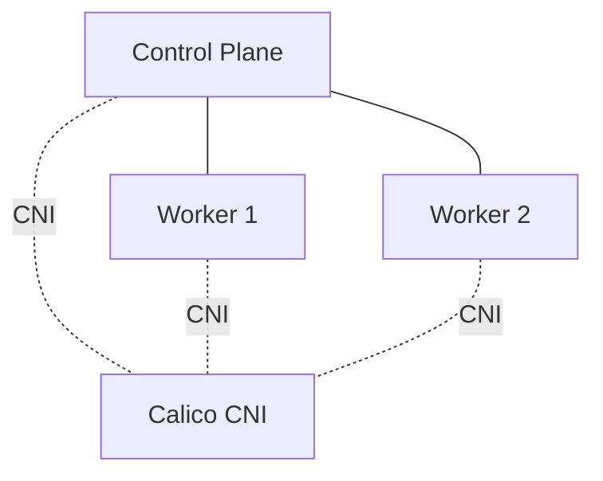

# k8s-hardened-baseline
Kubernetes Hardening Baseline following CKS practices: RBAC, Network Policies, Pod Security Standards, CIS Benchmark.

## Objective
Build and harden a Kubernetes cluster following CKS best practices.

## Scope
- CIS Benchmarks
- kube-bench
- RBAC Least Privilege
- Network Policies
- Pod Security Standards (Restricted)
- Security Audit Report

## Architecture

- **Cluster**: kind (Kubernetes in Docker), 1 control-plane + 2 workers
- **CNI**: Calico (default kindnet disabled — required for NetworkPolicy support)
- **Runtime**: containerd 2.3.4
- **Kubernetes version**: v1.37.0



## Project Roadmap
### Phase 1 — Cluster Setup ✅
- [x] Create multi-node Kind cluster
- [x] Disable default CNI (`disableDefaultCNI: true`) to enable NetworkPolicy support
- [x] Install Calico CNI
- [x] Validate all nodes `Ready`

### Phase 2 — Baseline Assessment 🔄
- [ ] Run kube-bench baseline scan
- [ ] Document findings (PASS/FAIL/WARN)
- [ ] Identify kind-specific false positives (containerized nodes vs. real VMs)

### Phase 3
- [ ] RBAC hardening

### Phase 4
- [ ] Network segmentation

### Phase 5
- [ ] Pod Security Standards

### Phase 6
- [ ] Before/After audit report

## Setup Notes & Troubleshooting

Issues encountered and resolved while provisioning the cluster — kept here as they reflect real debugging work, not just a scripted setup.

### Issue 1: API server bootstrap timeout with custom `extraArgs`
Adding `audit-log-path` to the control-plane's `extraArgs` without mounting a corresponding volume caused the API server to crash silently on startup (`ClusterRoleBinding` creation timeout). Removed for this phase; will be reintroduced properly with a dedicated volume mount when implementing audit logging.

### Issue 2: kubelet CrashLoopBackOff (`status=1/FAILURE`)
**Root cause**: host system running **cgroup v1**, while kind/kubelet v1.37 require **cgroup v2**.

**Diagnosis path**: `docker ps -a` → `crictl ps -a` (empty) → `systemctl status kubelet` (confirmed failure) → ruled out resource constraints (12 CPU / 8GB RAM, sufficient) → confirmed via `cat /sys/fs/cgroup/cgroup.controllers` (file not found = cgroup v1).

**Fix**: forced cgroup v2 in WSL2 via `.wslconfig`:
```ini
[wsl2]
kernelCommandLine = cgroup_no_v1=all
```
followed by `wsl --shutdown` and Docker Desktop restart. Verified with:
```bash
wsl -d docker-desktop cat /sys/fs/cgroup/cgroup.controllers
# → cpuset cpu io memory hugetlb pids rdma misc
```

### Issue 3: Nodes `NotReady` after cluster creation
Expected behavior — `disableDefaultCNI: true` means nodes remain `NotReady` until a CNI (Calico) is installed. Not a bug.

## Prerequisites
- Docker Desktop with WSL2 backend (cgroup v2 required)
- kind
- kubectl
- kube-bench

## Repository Structure
```
k8s-hardened-baseline/
├── cluster/
│   └── kind-config.yaml
├── rbac/
├── network-policies/
├── psa/
├── docs/
│   ├── kube-bench-before.txt
│   └── kube-bench-after.txt
└── README.md
```